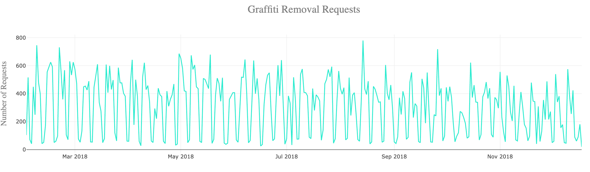

# Graffiti Removal in Chicago

## Project Purpose  

Each day the City of Chicago receives graffiti removal requests.  These requests are input and tracked through their 311 reporting system.  This project explores the data from the 311 Service Requests and will observe trends as well as tell a story through data visualization.

  

## Process 

###  A dynamic line graph that displays the number and the date of graffiti removal requests. 

This graph was created using D3.js library. 

 

  

### 3.2. An interactive table that filters the graffiti based on your ZIP code.  

Table was created using HTML/CSS. 

 

  

### 3.3. One Cluster Map that shows the address and the graffiti spot. 

The map was created using Leaflet library. 

 

  

### 3.4. One Heat Map that shows the area that have the highest number of graffiti complaints.  

The map was created using Leaflet library. 

 

         

4. The Dashboard page contains a Navigation Bar with buttons for all the maps, table, chart and the API data. 

5. We included a new Java Script library, CircleType.js, that allows us to curve text on our homepage. 

## Team: “Word on the Street”
Team Members: 
    Katie Young,
    Liliana Ilut,
    Vasil Nenov,
    Quentin Sloboda.
