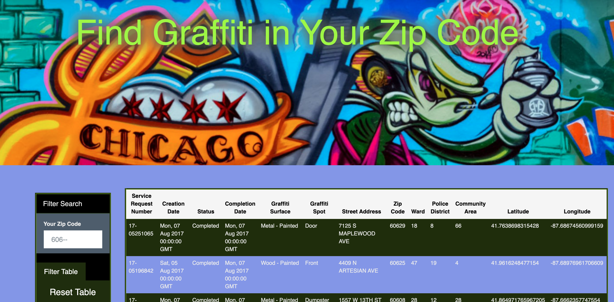

# Graffiti Removal in Chicago

## Background 

  

Each day someone in Chicago makes a call to 311 to report a graffiti that needs to be removed. The City of Chicago is doing a very good job to keep track of these graffiti and to removed them, some in a manner of days. Our project explores the data from 311 Service Requests - Graffiti Removal. The data set included with the assignment is found here : https://data.cityofchicago.org/Service-Requests/311-Service-Requests-Graffiti-Removal-Historical/hec5-y4x5/data. 

The goal of this project is to explore the data, observe trends, and tell a story through data visualization. 

  

### Requirements 

1. Our project includes a Python Flask–powered RESTful API, HTML/CSS, JavaScript, and SQL database. 

2. Pandas was used to scrap, clean, and push the data to a SQL database. 

3. Our project contains: 

  

### 3.1. A dynamic line graph that displays the number and the date of graffiti removal requests. 

This graph was created using D3.js library. 

 

  

### 3.2. An interactive table that filters the graffiti based on your ZIP code.  

Table was created using HTML/CSS. 

 

  

### 3.3. One Cluster Map that shows the address and the graffiti spot. 

The map was created using Leaflet library. 

 

  

### 3.4. One Heat Map that shows the area that have the highest number of graffiti complaints.  

The map was created using Leaflet library. 

 

         

4. The Dashboard page contains a Navigation Bar with buttons for all the maps, table, chart and the API data. 

5. We included a new Java Script library, CircleType.js, that allows us to curve text on our homepage. 

## Team: “Word on the Street”
Team Members: 
    Katie Young,
    Liliana Ilut,
    Vasil Nenov,
    Quentin Sloboda.
